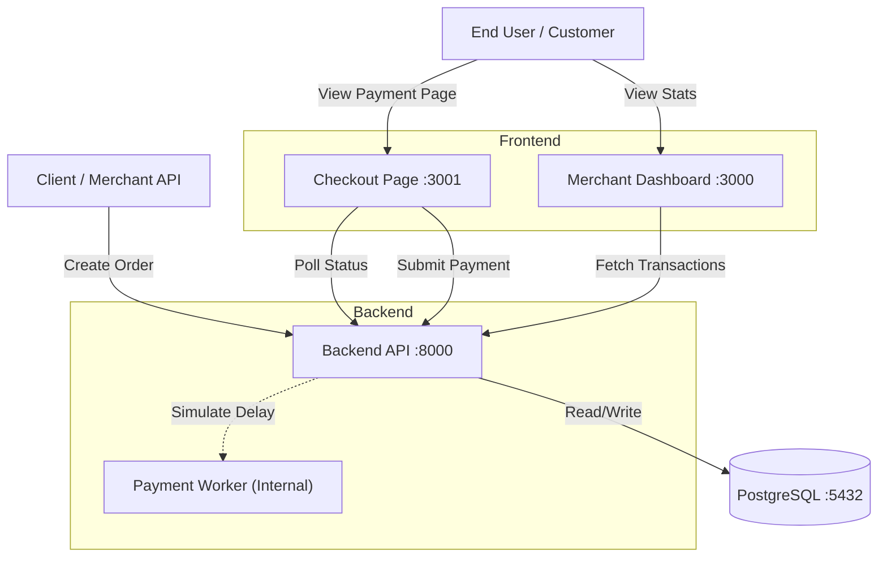

# System Architecture

## Overview
The Payment Gateway mimics a real-world payment processing system using a microservices-style architecture. It is built on the **PERN Stack** (PostgreSQL, Express, React, Node.js) and is fully Dockerized.

## System Diagram
The following diagram illustrates the data flow between the Client, Frontend Applications, Backend API, and Database.

## Data Flow Description
1.  **Order Creation:** The Merchant sends a POST request to the API to create an order. The API creates a record in the database with status `created`.
2.  **Checkout Initialization:** The Customer is redirected to the Checkout Page with the `order_id`. The page fetches order details.
3.  **Payment Processing:**
    * The Customer submits payment (UPI/Card).
    * The API validates inputs (Luhn Algorithm, VPA regex).
    * The API creates a payment record with status `processing`.
    * The system simulates a bank delay (5-10s) before randomly assigning `success` or `failed`.
4.  **Completion:** The Checkout Page polls the API to detect the status change and displays the result.