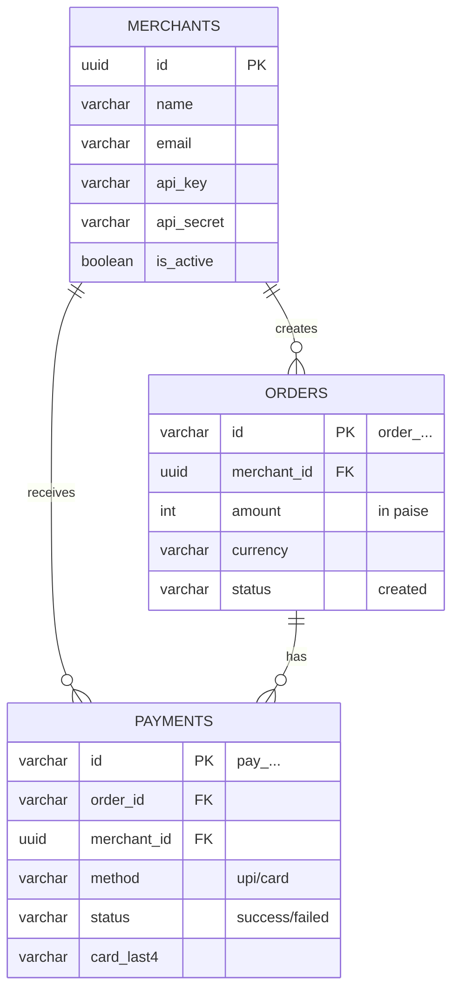

# Database Schema

## Entity Relationship Diagram
The database is normalized to 3NF. UUIDs are used for Merchant IDs for security, while custom IDs are used for Orders and Payments to mimic industry standards (e.g., Stripe).

## Table Details

### 1. Merchants Table
| Field | Type | Description |
|-------|------|-------------|
| `id` | UUID | Primary Key, Auto-generated |
| `email` | VARCHAR | Unique identifier for login |
| `api_key` | VARCHAR | Public key for API authentication |
| `api_secret` | VARCHAR | Private key (never shared) |

### 2. Orders Table
| Field | Type | Description |
|-------|------|-------------|
| `id` | VARCHAR | Unique Order ID (e.g., `order_x8s7...`) |
| `merchant_id` | UUID | Foreign Key linking to Merchants |
| `amount` | INTEGER | Amount in smallest currency unit (paise) |
| `status` | VARCHAR | Current state (`created`) |

### 3. Payments Table
| Field | Type | Description |
|-------|------|-------------|
| `id` | VARCHAR | Unique Payment ID (e.g., `pay_9a2b...`) |
| `order_id` | VARCHAR | Foreign Key linking to Orders |
| `method` | VARCHAR | Payment mode (`upi` or `card`) |
| `status` | VARCHAR | State (`processing`, `success`, `failed`) |